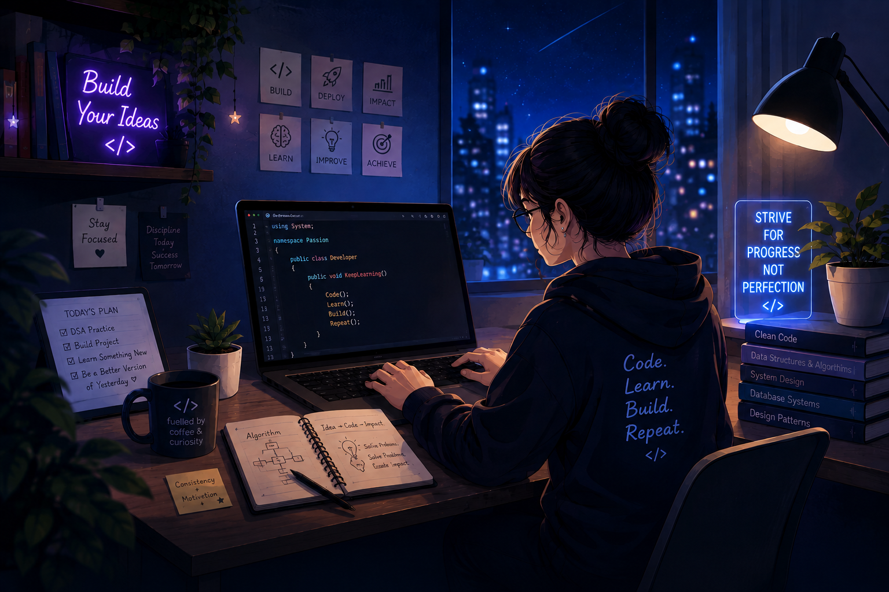

# Hi 👋, I'm Greshi Lunagariya

### 💻 Full-Stack Developer | .NET & ML Learner
<p align="center">
  
</p>


---

## 🚀 About Me

* 🎓 B.Tech Computer Science & Engineering student at **Darshan University**
* 💻 Full-stack developer passionate about building **real-world web applications**
* 🧠 Practicing **Data Structures & Algorithms** and solving problems on **LeetCode**
* 🌐 Experienced with **React, JavaScript, Node.js, Express.js, and SQL Server**
* ⚙️ Currently expanding my skills in **ASP.NET Core, C#, Entity Framework Core, and .NET**
* 🤖 Exploring **Machine Learning** and its practical applications
* 👨‍🏫 Working as a **Teaching Assistant**, helping students with programming and web development
* 🚀 Interested in **software development, backend engineering, and problem solving**
* 📈 Always learning, building, and improving one project at a time

---

## 🛠️ Tech Stack

### 💻 Programming Languages

<p>
  
</p>

### 🎨 Frontend Development

<p>
  
</p>

### ⚙️ Backend Development

<p>
  
</p>

### 🗄️ Database & ORM

<p>
  
</p>

### 🔧 Tools & Technologies

<p>
  
</p>

---

## 📚 Currently Learning

* ⚙️ **ASP.NET Core & C#**
* 🗃️ **Entity Framework Core**
* 🤖 **Machine Learning**
* 🏗️ **Backend Architecture & API Development**
* 🔐 **Authentication & Role-Based Authorization**
* 🧠 **Advanced Data Structures & Algorithms**

---

## 🎯 Current Focus

```text
Full-Stack Development  ███████████████████░  Learning & Building
Problem Solving         ██████████████████░░  Daily Practice
.NET & Backend          ████████████████░░░░  Exploring
Machine Learning        █████████████░░░░░░░  Learning
```

---

## 🚀 Featured Projects

### 🎓 Student Project Management System

A full-stack project management platform designed to manage students, faculty, projects, tasks, roles, and project allocations.

**Tech Stack:** React • ASP.NET Core • C# • Entity Framework Core • SQL Server

**Key Features:**

* 👥 User & Role Management
* 🎓 Student & Faculty Management
* 📂 Project Management
* ✅ Task Management
* 🔐 Role-Based Access Control
* 📊 Dashboard & Project Tracking
* 🔗 RESTful APIs

---

### 🏥 OPD Management System

A healthcare-oriented application for managing outpatient department operations.

**Tech Stack:** React • Node.js • Express.js • SQL Server

**Modules:**

* 🏥 Hospital Master
* 👨‍⚕️ Doctor Master
* 🩺 Diagnosis Master
* 💊 Treatment Master
* 🧑‍🤝‍🧑 Patient Registration
* 📋 OPD Management
* 🧾 Receipt Entry

---

## 🧠 DSA & Problem Solving

Preparing for **technical interviews and coding assessments** by strengthening problem-solving skills and understanding core DSA concepts.

### 🎯 Interview Preparation

* 🧩 Focus on **patterns and approaches** rather than memorizing solutions
* ⏱️ Analyze **Time & Space Complexity** for every solution
* 🔍 Practice choosing the **right data structure and algorithm**
* 💡 Improve ability to explain **approach, logic, and trade-offs**
* ⚡ Work on writing **optimized and clean code**
* 🐛 Practice identifying and fixing edge cases and bugs
* 🗣️ Improve explaining solutions clearly during technical interviews

### 🚀 Goal

> **Solve problems efficiently, explain the approach clearly, and write production-quality code under interview conditions.**

---

## 👨‍🏫 Teaching Assistant

### Teaching Assistant — Frontend Web Technology

As a Teaching Assistant, I help students understand programming and web development concepts.

**Responsibilities include:**

* 👨‍💻 Helping students understand programming concepts
* 🐛 Assisting with debugging and problem solving
* 🌐 Supporting students with frontend web development
* ⚛️ Helping with React and JavaScript concepts
* 🚀 Guiding students during project development

---

## 🔥 GitHub Streak

<p align="center">
  
</p>

---

## 📈 GitHub Activity

<p align="center">
  <a href="https://github.com/lunagariyagreshi">
    
  </a>
</p>

---

## 🌐 Let's Connect

<p align="center">
  <a href="https://github.com/lunagariyagreshi">
    
  </a>
  <a href="https://www.linkedin.com/in/greshi-lunagariya-27416033a/">
    
  </a>
</p>

---

## 🤝 Open To

* 💼 Software Development Opportunities
* 🚀 Full-Stack Development Projects
* 🤝 Collaboration on Interesting Projects
* 🧠 DSA & Problem-Solving Discussions
* 🌐 Web Development Discussions
* 🤖 Machine Learning Projects

---

## ⚡ Fun Fact

> 💡 I enjoy solving coding problems and turning ideas into real-world projects.

---

## 📈 My Development Journey

```text
C
 ↓
Java & OOP
 ↓
HTML • CSS • JavaScript
 ↓
React
 ↓
Node.js • Express.js
 ↓
SQL & Databases
 ↓
ASP.NET Core • C# • EF Core
 ↓
Backend Architecture
 ↓
Machine Learning 🚀
```

---

### 💙 Thanks for visiting my profile!

<p align="center">
  <b>Keep Learning • Keep Building • Keep Solving 🚀</b>
</p>
